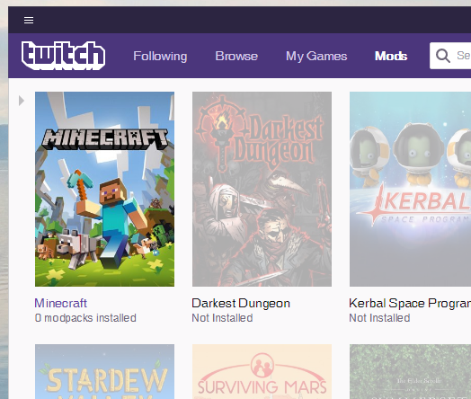
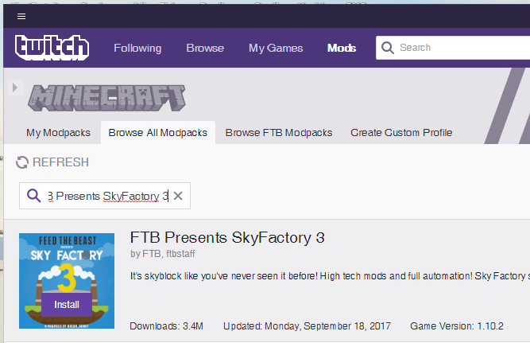
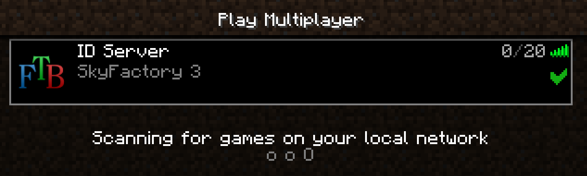

# ID:s Minecraft server (SkyFactory 3)

## Nuvarande IP-adress: [35.228.123.155:25566](35.228.123.155:25566)

## Om servern
Servern kör en moddad version (FTB Presents SkyFactory 3) av Minecraft 1.20.2. 

Ursprungligen startade vi enbart med ett träd på ett jordblock [svävnade i tomma intet](https://static.planetminecraft.com/files/resource_media/screenshot/1530/skyfactory9192960.jpg). Den moddade versionen låter oss använda tekniker och föremål som inte finns i det vanliga o-moddade Minecraft. För er som inte tidigare spelat moddat Minecraft finns det massor att lära sig och utforska, i synnerhet automatisering á la Factorio.

Servern körs på en virtuell maskin som hostas via [Google Cloud Platform](https://cloud.google.com/), i den finska staden [Hamina](https://en.wikipedia.org/wiki/Hamina) för att vara exakt. Till att börja med kör vi på en test-version där vi får hosta för 3000 riksdaler i ett år. I och med detta kan IP-adressen komma att ändras om vi måste flytta servern i framtiden.

#### Regler på servern
* Främst ID-are. Undantag kan göras efter överenskommelse.
* Förstör inte andras byggen. Stjäl inte folks prylar.
* Sunt förnuft & ID-kärlek<3.

## Steg-för-steg guide

#### Krav
* **Minecraft: JAVA EDITION**  
Du kommer behöva ha köpt [Minecraft Java-versionen](https://minecraft.net/sv-se/) till en kostnad av 225 riksdaler. Nedan förutsätts att du köpt, laddat ner och installerat denna. Mer information i följande länk: [https://minecraft.net/sv-se/](https://minecraft.net/sv-se/).
* En dator som inte är allt för [potatis](https://assetsds.cdnedge.bluemix.net/sites/default/files/styles/big_2/public/feature/images/potato_pc.jpg?itok=yvuy1BJ3) samt ha en del utrymme till övers på hårddisken..

#### 1. Twitch Desktop App
Ladda ned Twitch Desktop App från följande länk: [https://app.twitch.tv/](https://app.twitch.tv/). I den tankas modden ner och startas.

#### 2. Installera FTB Presents SkyFactory 3
* Öppna Twitch-appen och gå till **Mods**-fliken.  

  

* Klicka på Minecraft.
* Öppna **Browse All Modpacks**-fliken. (Notera att Twitch-appen kan vara lite trött, ha tålamod)

 
* Sök och installera **"FTB Presents SkyFactory 3"**. Använd **"Game Version 1.10.2"**. Detta kommer ta en stund.
* När installeringen är färdig, tryck på **"Play"**. Därefter startas Minecraft med SkyFactory-modden.

#### 3. Anslut till servern
* Inne i Minecraft Launcher klicka på **SPELA**.
* Nu startas Minecraft med SkyFactory-modden, detta kan ta en bra stund.
* Du kommer få en varning om att det finns osäkra versioner av moddar, klicka på **"Continue"**.
* Klicka på **"Multiplayer"**.
* Klicka på **"Add server"**.
* Ange **valfritt "Server Name"**.
* I fältet "Server Adress" ange **IP-adressen längst upp på denna sida**.
* Klicka **"Done"**.

* Dubbelklicka på den nya servern i listan.
* **TJOOOHOOOO, DU ÄR INNE! VÄLKOMMEN!**
